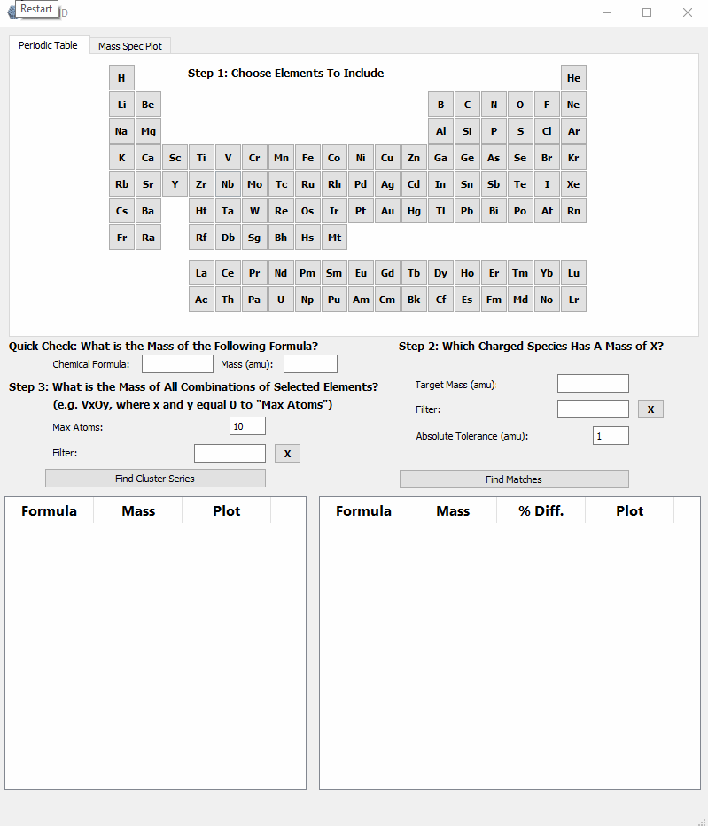
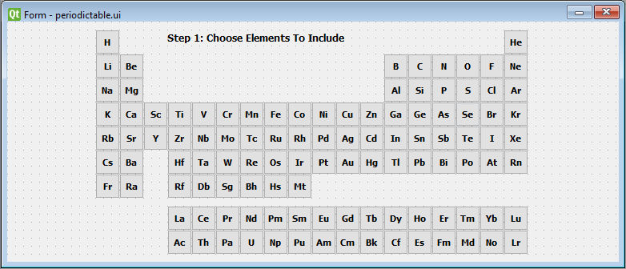
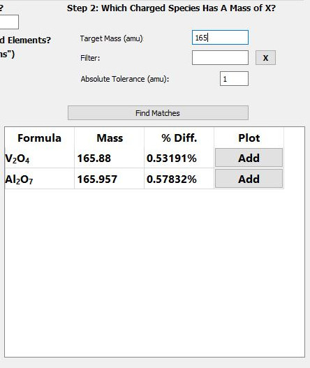

### Introduction

Mass spectrometry is easy, right? The instrument spits out a mass spectrum, the
user identifies each of the species in the calibrated mass spectrum by
adding up the masses of the elements until they match the mass of each peak, and
and everyone goes home happy.

Often times it works like this. Other times, like when we transitioned to making
metal and metal-oxide clusters, deciphering the mass spectra became much more difficult.
Instead of a couple of atoms, we are now concerned with 20+ atoms of multiple elements
represented by a single peak, and in some cases, multiple isotopes.

After spending numerous kinetic runs manually adding up the masses for each combination
or elements I suspected were present, I decided it would be worthwhile to try to
write a program that can predict the cluster/molecule based on elements selected by
the user.


Selecting elements V, Al and O to identify a peak at 165 amu.

You can see from the above .gif that the user can select the elements they are interested in,
enter the unknown mass, and the program will try to guess the clusters within a manually
set absolute tolerance.

The general structure of ClusterID includes a `MainWindow()` class that instantiates widgets
as attributes of the `MainWindow()` instance. The widgets themselves are smaller
programs whose purpose is a single "function" such as a periodic table to select
elements from, or a plot area to display the isotopic distribution of the selected
clusters.

### The Periodic Table Widget

The idea behind the program is that we can select the elements we suspect are in
our spectrum by clicking on them in the periodic table. For organizational and modularity reasons,
we will separate different program functionality into modules (or widgets in the language of Qt).
To select different elements, we will need to create a periodic table widget.
Here's what it will look like in PyQt Designer:



Each element is a "checkable" PushButton that will emit a custom signal containing information,
the mass in particular, to be received by other parts of the program.

To create the widget, we'll create a new .py script and include our periodic table UI:

```python
class PeriodicTable(QWidget):
  def __init__(self):
    super().__init__()

    self.ui = Ui_PeriodicTable()
    self.ui.setupUi(self)

if __name__ == '__main__':
    app = QApplication(sys.argv)
    window = PeriodicTable()
    window.show()
    sys.exit(app.exec_())
```

Great, but the elements mean nothing without data, so we'll need a way to access
element-specific information (e.g. mass) when clicked on. We'll do this by creating
a dictionary that includes the elemental symbols as keys and elemental information
as values. For this, I created a simple module containing the elemental data in a class
called ElementalData, which was previously scraped from the NIST web book. The data is
in the form of a list of dictionaries:

`elementdata.py`
```python
class ElementData:
  def __init__(self):
    self.elements = [
      {
        "number": 1,
        "mass": 1.008,
        "name": "Hydrogen",
        "symbol": "H",
        "mp": -259.0,
        "bp": -253.0,
        "density": 0.09,
        "group": 1.0,
        "config": "1s1",
        "IE": 13.6,
	      "isotopes": ((1.008, 0.999885), (2.014, 0.000115))
      },
      {
        "number": 2,
        "mass": 4.003,
        "name": "Helium",
        "symbol": "He",
        "mp": -272.0,
        "bp": -269.0,
        "density": 0.18,
        "group": 18.0,
        "config": "1s2",
        "IE": 24.59,
	      "isotopes": ((3.016, 0.000001), (4.003, 0.999999))
      }
      #...
    ]
```

There is a lot of information here, but for now we will just worry about mass, symbol,
name, and number. For this, we will parse the relevant information into an object
for each element:

`elements.py`
```python
class Element:
    def __init__(self, mass, symbol, name, number):
        self.mass = mass
        self.symbol = symbol
        self.name = name
        self.number = number
```

`periodictable.py`
```python
class PeriodicTable(QWidget):

  def __init__(self):
    super().__init__()

    self.ui = Ui_PeriodicTable()
    self.ui.setupUi(self)

    self.elements = ElementData().elements
    self.periodicTable = {}

    for element in self.elements:
      self.periodicTable[element['symbol']] = Element(element['mass'], element['symbol'], element['name'], element['number'])
```

At this point, we have a python dictionary that contains keys representing
elemental symbols, which correspond to values that are Element objects that contain
information about the specific element. How do we make this available to other
parts of the program? That's where the signals and slots paradigm comes in.

### PyQt5: Signals and Slots

GUI applications are event-driven. When an event takes place (e.g. a button is clicked, a form submitted, a slider changes
value), PyQt5 can emit a signal. Nothing happens with a signal unless it is connected to
a slot, a function written to execute some code when the signal is received.

There are many built in signals in Qt5/PyQt5, such as the signal emitted when a
button is clicked. In fact, our design will make use of this signal in the following way:

1. Element button clicked
2. Signal sent (with bool argument representing checked state)
3. Signal received by slot
4. Slot function retrieves element object based on attributes of the sending button
5. Periodic table widget emits custom signal with Element object as argument
6. Emitted signal (and element object) can be received by a slot elsewhere in the program

To connect the "clicked" signal to a slot, we iterate over the buttons:

`periodictable.py`
```python
class PeriodicTable(QWidget):

    def __init__(self):
        super().__init__()

        # ...

        for element in self.elements:
            self.periodicTable[element['symbol']] = Element(element['mass'], element['symbol'], element['name'], element['number'])

        # Iterates through all the element buttons ('ebtn') and adds click
        # behavior. Naming convention: ebtnMo, ebtnMn, etc.
        for name in dir(self.ui):
            subClass = 'ebtn'
            if subClass in name:
                btn = getattr(self.ui, name)
                btn.clicked[bool].connect(self.emitElement)

    # Slot for element button clicked signal
    # Emits custom signal with elemental symbol and boolean
    def emitElement(self, checked):
        symbol = self.sender().text()
        elementObject = self.periodicTable[symbol]
        self.elementEmitted.emit(elementObject, checked)
```

This connects the "clicked" signal for each button (Step 2) to the
self.emitElement() function (Step 3), which then takes care of passing the
corresponding element object to our yet-to-be-defined custom signal (Steps 4 & 5).

To create a custom signal, we import the pyqtSignal object and create
The signal needs to be added after class declaration but before the constructor,
as an attribute of the PeriodicTable class:

`periodictable.py`
```python
from PyQt5.QtCore import pyqtSignal

class PeriodicTable(QWidget):

    # Custom signal
    elementEmitted = pyqtSignal(object, bool)

    def __init__(self):
        super().__init__()
        # ...
```

The arguments are the Python types that will describe the arguments passed to the
elementEmitted class attribute.

### PyQt5: Combining Widgets into a Main Window

Alright, great. Now we have this periodic table that emits objects when the buttons
are pressed. How do we combine that with other widgets/functionality contained in the
main program?

First, it's worth noting that ClusterID is essentially a main window that "loads"
multiple widgets and allows them to talk to each other (with signal and slots) and
the functionality found in the main window.

When an instance of ClusterID is executed, we want the main window to save instances of
the widgets as attributes:

```python
class MainWindow(QMainWindow):

    formulaEmitted = pyqtSignal(str)

    def __init__(self):
        super().__init__()

        #...

        self.periodicTableWidget = PeriodicTable()
        self.massSpecWidget = MassSpec()
        self.tofView = TofView()

        # Connects symbol emitted from periodicTableWidget to slot
        self.periodicTableWidget.elementEmitted.connect(self.handleElementClicked)

        self.periodicTableWidget.elementEmitted.connect(self.tofView.handleElementClicked)
```

And because we are simply talking about signals and slots, we can connect them just like
we would if it all took place within a single widget. You'll see that there is another,
unintroduced widget (TofView) that I want to be aware of the selected elements.

Let's briefly talk about `self.handleElementClicked`. It is simply a slot for the
custom signal emitted by the periodic table widget:

```python
# Slot for emitted element symbol and checked boolean from periodicTableWidget
# Updates list of selected element objects
def handleElementClicked(self, elementObject, checked):
    mass = elementObject.mass
    symbol = elementObject.symbol
    if checked and elementObject not in self.selectedElements:
        self.selectedElements.append(elementObject)
    elif not checked:
        self.selectedElements.remove(elementObject)
```

And all it does is check the status ('checked') received with the element object
and add or remove the element from a list based on that status.

Now that we've selected elements that we believe might make up the clusters generating
the peaks in the mass spectrum, let's see if we can develop an algorithm that provides,
at least, a tolerable guess at what it might be.

### "Find Matches" Algorithm

The GUI that handles the find matches algorithm looks like this:



After selecting elements, the user will enter the target mass,
(the mass of the unknown cluster), define a tolerance, click the find matches button,
and marvel at the tabulated results.

The function that coordinates all of this is: `self.handleFindMatches()`.

The handleFindMatches function handles each step of the match generation process.
The first step is to get the atomic masses for each of the selected elements,
which are sorted my mass:

```python
def handleFindMatches(self):
    # Find elemental masses for element list populated by pushbuttons
    sortedElementObjects = sorted(self.selectedElements, key=attrgetter('mass'), reverse=True)

    sortedMasses = [element.mass for element in sortedElementObjects]
```

Next, we will initialize a "combination template". These values will ultimately be
used as subscripts for the possible molecules that match the target mass
(e.g. [3, 3, 2] for V<sub>3</sub>Al<sub>3</sub>O<sub>2</sub>).

The next section is the heart of the handleFindMatches function. Here we iterate
through all combinations of elements and return the ones that match the target mass
(within a specified amu tolerance) in the form of a list of sets. Each set represents
a theoretical combination of elements with a matching mass.

```python
def handleFindMatches(self):

    # ...

    allanswers = findMatch.recursiveFindCombinations(self.targetVal, sortedMasses, self.absoluteTolerance, combination=combinationTemplate, answer=set())
```

The next few lines deal with sorting and presenting the results:

```python
def handleFindMatches(self):

    # ...

    # Sort answers by total atoms
    sortedallanswers = sorted(allanswers, key=sum)

    # Create list of dicts and populate with first 20 answers (by lowest
    # total atoms), pct dif from target, and precise mass
    answerDicts = []
    for answer in sortedallanswers[:]:
        preciseMass = findMatch.findPreciseMassFromCombination(answer, sortedMasses)
        pctDif = utils.findPercentDifference(preciseMass, self.targetVal)
        answerDict = {}
        formula = ''
        for index in range(len(answer)):
            if answer[index] > 0:
                formula = formula + sortedElementObjects[index].symbol + str(answer[index])
        answerDict['formula'] = formula
        answerDict['part'] = answer
        answerDict['pctDif'] = pctDif
        answerDict['preciseMass'] = preciseMass
        answerDict['uniqueElements'] = findMatch.findNumberOfElements(answer)
        answerDict['atomSum'] = sum(answer)
        answerDicts.append(answerDict)

    # Sort by number of unique elements, then total number of atoms
    sortedUniqueElementsAndSum = sorted(answerDicts, key=itemgetter('atomSum', 'uniqueElements'))
```

First, the results are sorted by total atoms since it's an easy way to weed out unlikely
clusters/molecules. For example, searching for a cluster consisting of Al, V, O, and/or H
at mass 168 would yield sensible answers like VAl<sub>2</sub>O<sub>4</sub> and nonsensical answers like, OH<sub>151</sub>
and H<sub>167</sub>. By sorting by total atoms, obvious nonsense clusters will show up at the bottom of
the list. In the future, it may be prudent to add basic bonding limits to reduce nonsensical
answers. The keen-eyed reader may have noticed the filter line edit in the above image, but
for the sake of brevity, it is not included here.

Underneath it all, what is the algorithm being used to find all of the combinations?

At its most basic, the question that the algorithm answers is: In what ways can we partition
a number (the target mass) using a set of smaller numbers (the masses of the selected elements)?
In other words, what are all the possible combinations?

My approach was a recursive function that iterates through each combination that adds to
the target mass within a defined tolerance:

```python
# Finds all possible ways to partition the target value
# with the values contained in a list.
# Recursively finds each combination by incrementing last value in list by +1 until no remainder,
# then increments the second to last by +1, etc.

# Returns a set of sets (each being a suitable combination)
def recursiveFindCombinations(target, numList, tol, depth=0, combination=[], answer=set()):
  if numList != []:
    maxIons = int(target // numList[0]) + 1

    # Adds an additional multiple of the current value for each iteration
    for i in range(0, maxIons + 1):

      # Most target values will be integers. This allows for some tolerance between precise atomic
      # masses and imprecise target value
      if abs(target - numList[0] * i) <= tol:
        remainder = 0
      else:
        remainder = target - (numList[0] * i)
      combination[depth] = i

      # Terminating case: when the target is matched, combo list is copied
      if numList[1:] == [] and remainder == 0:
        answer.add(tuple(combination[:]))

      # Recursion: calls the function for the next value in numList
      recursiveFindCombinations(remainder, numList[1:], tol, depth + 1, combination, answer=answer)
  return answer
```

To begin, the function takes six arguments:
1. The target mass
2. A list of floats corresponding to the masses of the selected elements
3. The absolute tolerance
4. The recursion depth
5. A list representing the number of each element in a combination of elements
6. A set of answers that will ultimately be returned by the function

The first thing our function does is determines the max number of the first element in
`numList` that could possibly be contained in a cluster with the mass equal to `target`.

It proceeds to iterate over the range of the maximum number of atoms for that element.
During each iteration (which can be thought of as adding one more of that atom to the total mass),
it checks to see if the new value is within the defined tolerance and if it is,
the remainder is considered to be zero and the combination is added to the answer set.

In this algorithm, the recursive depth can be thought of as a single element, where depth = 0
corresponds to one element and depth = 1 corresponds to a different selected element. Because
of this, depth is also used as the index of the combination list being built, hence
`combination[depth] = i`.

The terminating case of the recursive function is triggered when we've been through
every selected element represented in `numList` and there is no remainder.

Trying a "simple" example like selecting H and O and using 18 amu (H<sub>2</sub>O) as a target,
we would see the following values right before the recursive call:

```python
# Depth of 1 (first time through, i = 0):
remainder:  18.0, numList[1:]:  [1.008], depth + 1:  1, combination:  [0, 0], answer:  set()

# Depth of 2 (adding hydrogens from 0 to 17):
remainder:  18.0, numList[1:]:  [], depth + 1:  2, combination:  [0, 0], answer:  set()
remainder:  16.992, numList[1:]:  [], depth + 1:  2, combination:  [0, 1], answer:  set()
remainder:  15.984, numList[1:]:  [], depth + 1:  2, combination:  [0, 2], answer:  set()
remainder:  14.975999999999999, numList[1:]:  [], depth + 1:  2, combination:  [0, 3], answer:  set()
remainder:  13.968, numList[1:]:  [], depth + 1:  2, combination:  [0, 4], answer:  set()
remainder:  12.96, numList[1:]:  [], depth + 1:  2, combination:  [0, 5], answer:  set()
remainder:  11.952, numList[1:]:  [], depth + 1:  2, combination:  [0, 6], answer:  set()
remainder:  10.943999999999999 , numList[1:]:  [], depth + 1:  2, combination:  [0, 7], answer:  set()
remainder:  9.936, numList[1:]:  [], depth + 1:  2, combination:  [0, 8], answer:  set()
remainder:  8.928, numList[1:]:  [], depth + 1:  2, combination:  [0, 9], answer:  set()
remainder:  7.92, numList[1:]:  [], depth + 1:  2, combination:  [0, 10], answer:  set()
remainder:  6.911999999999999, numList[1:]:  [], depth + 1:  2, combination:  [0, 11] , answer:  set()
remainder:  5.904, numList[1:]:  [], depth + 1:  2, combination:  [0, 12], answer:  set()
remainder:  4.896000000000001, numList[1:]:  [], depth + 1:  2, combination:  [0, 13], answer:  set()
remainder:  3.888, numList[1:]:  [], depth + 1:  2, combination:  [0, 14], answer:  set()
remainder:  2.879999999999999, numList[1:]:  [], depth + 1:  2, combination:  [0, 15], answer:  set()
remainder:  1.8719999999999999, numList[1:]:  [], depth + 1:  2, combination:  [0, 16], answer:  set()
remainder:  0, numList[1:]:  [], depth + 1:  2, combination:  [0, 17], answer:  {(0, 17)}

# Depth of 2 (18 hydrogens is also within tolerance):
remainder:  0, numList[1:]:  [], depth + 1:  2, combination:  [0, 18], answer:  {(0, 17), (0, 18)}

# Depth of 1 (first time an oxygen is added):
remainder:  2.0009999999999994, numList[1:]:  [1.008], depth + 1:  1, combination:  [1, 18], answer:  {(0, 17), (0, 18)}

# Depth of 2 (one H and one O are within tolerance, barely):
remainder:  2.0009999999999994, numList[1:]:  [], depth + 1:  2, combination:  [1, 0], answer:  {(0, 17), (0, 18)}
remainder:  0, numList[1:]:  [], depth + 1:  2, combination:  [1, 1], answer:  {(0, 17), (1, 1), (0, 18)}

# Depth of 2 (an additional H is added to make H2O)
remainder:  0, numList[1:]:  [], depth + 1:  2, combination:  [1, 2], answer:  {(0, 17), (1, 1), (0, 18), (1, 2)}

# Depth of 1 (adding another O would result in too high a mass relative to target):
# Following this iteration, the answer set is returned.
remainder:  -13.998000000000001, numList[1:]:  [1.008], depth + 1:  1, combination:  [2, 2], answer:  {(0, 17), (1, 1), (0, 18), (1, 2)}
```

The returned set contains tuples that correspond to H<sub>17</sub>, OH, H<sub>18</sub>, and O<sub>1</sub>H<sub>2</sub>, respectively.

The set, `{(0, 17), (1, 1), (0, 18), (1, 2)}` is what is returned in the above,

```
allanswers = findMatch.recursiveFindCombinations(self.targetVal, sortedMasses, self.absoluteTolerance, combination=combinationTemplate, answer=set())
```

All that's left is to format the tuples into something resembling a chemical formula
and display it.

### Display Matches in a Table

To present the results in the table, we will first create a new function: `showMatches()`

```python
# Function that populates the table with rows to be returned for the find matches functionality
# elementObjects: a list of objects repesenting elements in the periodic table
# matchList: a set of sets (each set is a suitable combination)
def showMatches(self, matchList, tableWidget, pctDif):
  for i in range(len(matchList)):
      if matchList[i]['formula']:
          # Adds <sub> tags to the formula string
          matchString = utils.formatFormula(matchList[i]['formula'])
          tableWidget.setCellWidget(i, 0, QLabel(matchString))
          # Uses the modified QTableWidgetItem with updated sorting method
          preciseMassTableItem = NumericTableItem(str(round(matchList[i]['preciseMass'], 5)))
          # Sets data to the float value of precise mass for sorting reasons
          preciseMassTableItem.setData(Qt.UserRole, matchList[i]['preciseMass'])
          tableWidget.setItem(i, 1, preciseMassTableItem)
          if pctDif:
              pctDifTableItem = NumericTableItem(str(round(matchList[i]['pctDif'], 5)) + '%')
              pctDifTableItem.setData(Qt.UserRole, matchList[i]['pctDif'])
              tableWidget.setItem(i, 2, pctDifTableItem)
              self.addBtn = QPushButton('Add')
              self.addBtn.clicked.connect(lambda: self.handleCellButton(tableWidget))
              tableWidget.setCellWidget(i, 3, self.addBtn)
          else:
              self.addBtn = QPushButton('Add')
              self.addBtn.clicked.connect(lambda: self.handleCellButton(tableWidget))
              tableWidget.setCellWidget(i, 2, self.addBtn)
```

For each object in the matchList, we will jump through a hoop or two to get the formula
to display with the proper subscript formatting since `QTableWidgetItem`s do not support rich text.
To acheive this we will:

1. Format the formula with `<sub></sub>` tags
2. Set the text of a QLabel object to the rich-text-formatted formula string
3. Insert the QLabel object into the table widget cell.

Additionally, I rewrote the sorting function for the QTableWidgetItem. It's default behavior
is to sort the values as a string, meaning that 1, 2, 3, 4, 11, 22, 33 would sort to
1, 11, 2, 22, 3, 33, 4, which is obviously not what we want when sorting by smallest
difference between target mass and the masses of the matched clusters. The NumericTableItem
now looks like this:

```python
# Redefined 'less than' function for QTableWidgetItem that allows data stored
# as integer (rather than string) to be used when sorting by column
class NumericTableItem(QTableWidgetItem):
    def __lt__(self, other):
        return (self.data(Qt.UserRole) < other.data(Qt.UserRole))
```

Each cell for a matched cluster that represents a numeric value (e.g. percent
difference, mass, etc.) will display the value in the table as a string type,
but we will assign the data attribute to the corresponding value as a float/int type.
It is these data attributes that will be sorted when the user clicks the column heading.
