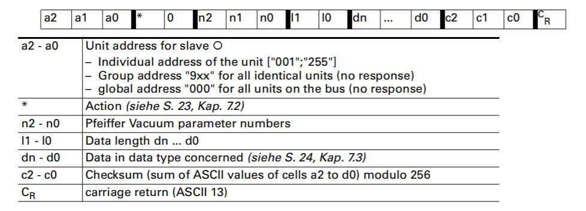
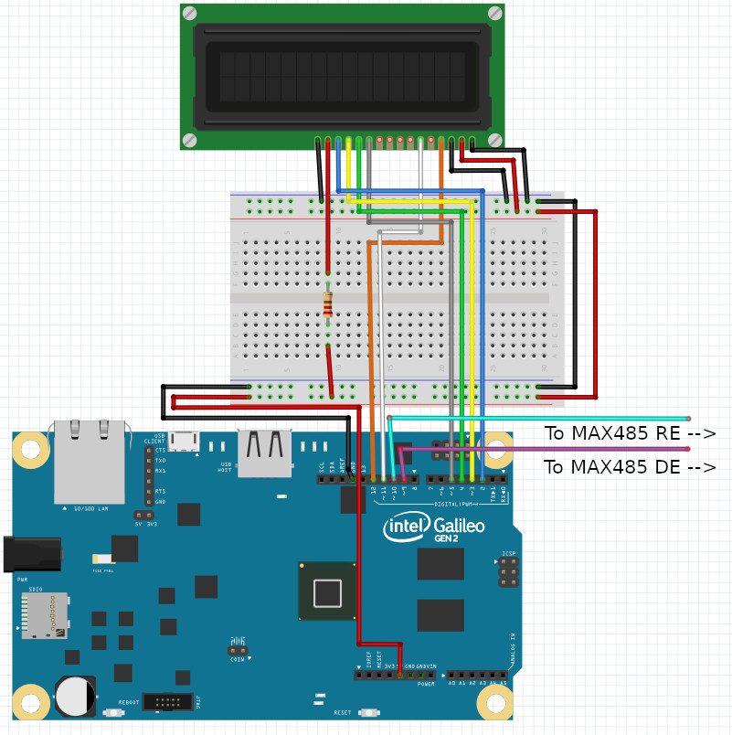
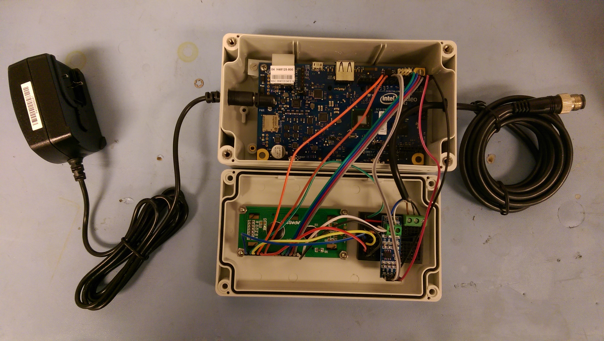
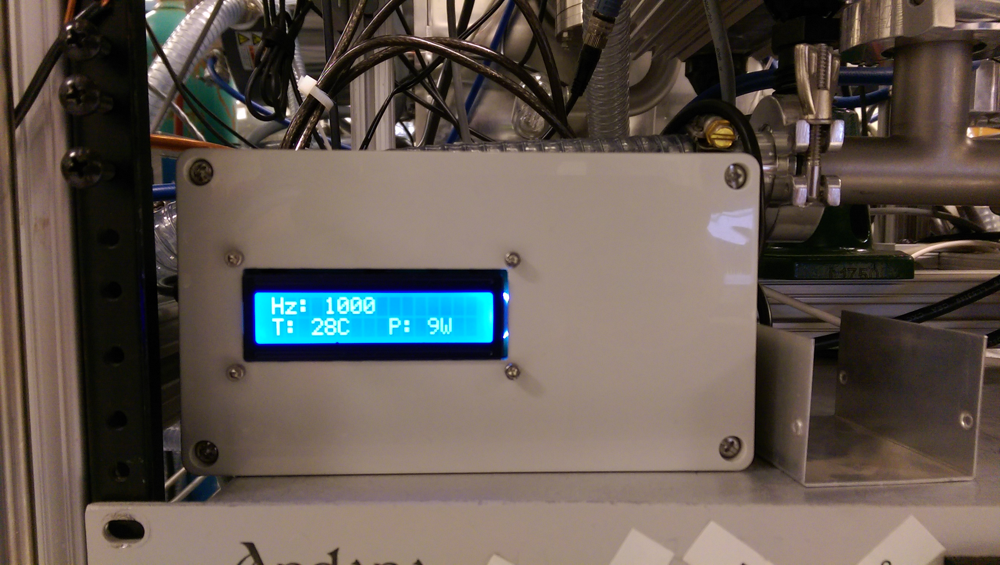
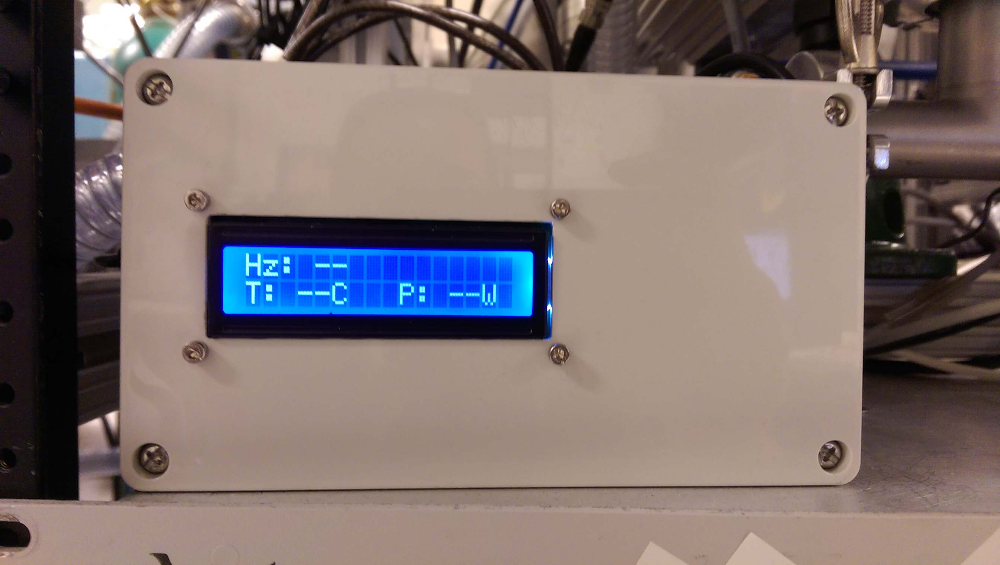

*Disclaimer: This post is for informational purposes only. Turbomolecular pumps are expensive and mistreatment can permanently damage them, sometimes violently. If this post inspires you to create something similar please proceed at your own risk.*

## Backstory

We have an instrument with 495,212 turbo pumps (slight exaggeration, there are only 12). For the most part,
our variable-temperature selected ion flow tube is separated into 'sections' by
pneumatic gate valves that allow venting and for us to vent one section to atmosphere
(to switch metal sources, maintenance/cleaning, etc.) while leaving others at high vacuum.
In addition to knowing how hard turbos are working (e.g. power, temperature, rotation speed)
when other sections of the instrument are vented, it's good practice to keep an eye on them whenever an experiment is taking place and gases are flowing. So, it can be frustrating
when a turbopump in service doesn't have any control or readout beyond a simple on/off switch...
like our Pfieffer Splitflow turbopump.

Our Pfieffer Splitflow turbo was already equipped upon delivery with a Pfieffer TC 110
Electronic Drive Unit and communicating with that unit is what this project is all about.


The Pfieffer TC 110.

For years, the only information we knew about the health and status of the pump
was whatever we could decipher from the red, yellow, and green LEDs. Essentially it was
"none" equals power off, red and yellow equals spinning down, and best of all,
green equals full speed *OR* spinning up! Now, these pumps are designed to be very robust,
but I was still quite surprised to learn that green could mean either "ready" or
"still turning on". To better monitor this pump, I built a readout specifically for it
(and the TC 110) here's how:

Other than the LEDs, there are two connections, the X3 which came connected to a
power supply by our supplier, and the PV.can which is an unfamiliar (to me at the time)
M12 socket.

The PV.can M12 is included in the TC 110 specifically for the purpose of RS485
communication with a computer. So the project boils down to this: query the pump using
it's ASCII parameter language about the metrics we are interested in (rotation speed,
temperature, and power).

## The Pfieffer Vacuum Protocol

The Pfieffer Vacuum Protocol for RS485, like many, looks verbose at first glance. It
is just a string of ASCII characters terminated by a carriage return. Here is a breakdown
of what those characters mean:



ASCII string structure for the Pfieffer Vacuum Protocol.

Using rotation speed as an example, we want to query our pump, and the ASCII string
would look something like this: `0010030902=?107\r`
* **a1 - a0**: the address of the pump being queried, 001
* **\*, 0**: control command. We only want read access, so 00
* **n2 - n0**: the parameter number associated with the actual speed command being sent, 309 (See drive unit manual for commands and associated parameters)
* **l1, l0**: the total number of characters in the following data section of the string, 02
* **dn - d0**: the data section of the string, =?
* **c2 - c0**: the checksum value, 107
* **C<sub>R</sub>**: carriage return for string termination, \r

A quick note on the checksum value: The Pfieffer protocol uses a checksum to verify
the integrity of the message received by checking that the value included matches
its own internal calculation. Here that value is found by calculating the sum total
of the ASCII string before checksum and performing 256 % total = checksum.

Constructing the ASCII strings for temperature (keyword "TempMotor") and power
(keyword "DrvPower") results in `0010034602=?108\r` and `0010031602=?105\r`, respectively.

At this point, you could hookup a computer to the pump drive using a M12 to USB cable
and check any of these values by sending the corresponding ASCII string. However,
I wanted a device that would continuously check these values and to package it into
a similar form-factor as the rest of our turbopump controllers.

For this project, I used a discontinued Intel Galileo microcontroller because we
have some lying around, but an Arduino would also work with some minor code tweaks.

## Parts

Other than the microcontroller, other important components used are:
* 1x 16x2 LCD Display
* 1x MAX 485 RS-485 Breakout Board
* 1x breadboard or protoboard
* 1x 220 ohm resistor
* 1x SD card (if using the Intel Galileo, which has no persistent storage)
* 1x male M12 cable. Like __[this one](https://smile.amazon.com/uxcell-raight-Connector-Aviation-Electrical/dp/B01NAVIATA/)__

## Wiring It Up

Here is a wiring diagram to help get it put together. It may appear messy, but it's as simple as
wiring up a basic 16x2 LCD and a MAX 485 RS-485 breakout board. Plenty of online resources and
tutorials exit that cover the details of each of those components in more depth.



The turbopump readout all wired up and mounted in its enclosure:



## Software

First, let's simply set up the LCD by importing the library, assigning pins,
calling the begin function, setting the cursor location, and printing a short message.

All of this will be performed as part of the initial setup procedure:

```c++
#include <LiquidCrystal.h>

LiquidCrystal lcd(12, 11, 5, 4, 3, 2);

void setup() {
  // Serial to RS485:
  Serial1.begin(9600);
  // Serial to USB for debugging
  Serial.begin(9600);

  lcd.begin(16, 2);
  lcd.setCursor(0, 0);
  lcd.print("Starting...");
}

void loop() {
  // Nothing to loop through yet...
}
```

At this point, the program doesn't do anything but display "Starting..." on the LCD.
Let's work on setting up the RS 485. But first, a quick note about the RS-485 communication protocol:

Like RS-232, RS-485 is a serial protocol that transmits data over three transmission lines:
ground (GND), transmit (TX), and receive (RX).

RS-485 transmits data via a differential electric signal over two wires for a higher
baud rate, longer cable length, and reduced susceptibility to noise than RS-232. Unlike RS-232, RS-485 and RS-422
are designed for multiple drops on the same two wire cable, hence the multiple possible
driver addresses in the Pfieffer Vacuum Protocol.

Unfortunately, the Intel Galileo and Arduino do not support RS-485 natively, so we
must convert the signal from the UART on the Intel Galileo to RS-485 with the MAX 485 integrated circuit.

Let's set that up in the program:

```c++
#include <LiquidCrystal.h>

LiquidCrystal lcd(12, 11, 5, 4, 3, 2);

//RS485 Communication control pins
#define SerialDEpin 9
#define SerialREpin 10

// Values used for RS485 communication control
#define READ 0
#define WRITE 1

void setup() {
  //...

  //RS485 Communication control pins
  pinMode(SerialDEpin, OUTPUT);
  pinMode(SerialREpin, OUTPUT);
  RS485Mode(READ);
}

void loop() {
  // Nothing to loop through yet...
}
```

In the RS-485 protocol, the RE (Receiver Enabled) and DE (Driver Enabled) control
communication direction. RE is active-low, meaning it must be pulled low to receive and DE is active-high,
meaning it must be pulled high to send. In this application, which will switch between send
and receive, they can effectively be tied together.

Let's add a helper function that abstracts the mode change:

```c++
// Helper function for changing both RS485 comm pins
// to receive or transmit
void RS485Mode(bool mode) {
  digitalWrite(SerialDEpin, mode);
  digitalWrite(SerialREpin, mode);
}
```

## The Loop

Alright, time to tackle the code that will loop continuously while the device is powered on.
Sending and receiving messages depends on certain intervals, so we need to keep track of time in
a relative sense, so store the current runtime:

```c++
void loop() {
  // Current runtime in ms
  // Sending of serial messages, LCD value refresh, and "blank" LCD (no new data)
  // depend on independent update intervals
  unsigned long currentMillis = millis();
}
```

Based on some trial and error, it seems only one message can be sent to the pump
at a time (this doesn't work: "0010030902=?112\r0010034602=?108\r0010031602=?105\r").
Therefore, we'll have to loop through the different messages.

During each run though the loop, we want to check if we've waited longer than the
defined interval. If we have, change the RS-485 mode to "write", send a message, increment
the counter to the next message, wait until the message sends, and switch the mode back to "read".

This is the function that I came up with:

```
// Used to cycle through messages for Serial.write()
// It seems that Pfeiffer TC 110 only accepts one message per Serial.write()
// or the RS485 r/w timing is slightly off,
// thus queryTurn cycles through messages
int queryTurn = 0;

unsigned long lastCheckMillis = 0;

void loop() {
  // Current runtime in ms
  // Sending of serial messages, LCD value refresh, and "blank" LCD (no new data)
  // depend on independent update intervals
  unsigned long currentMillis = millis();
  // Only one message can be sent at a time to the pump drive it seems
  // Also, less than or greater than ~20s delay seems to either not send the message
  // or not give enough time to receive
  if (currentMillis - lastCheckMillis > interval) {
    RS485Mode(WRITE);
    if (queryTurn == 0) {
      //[P:309] ActualSpd, 0010030902=?112\r
      Serial1.write("0010030902=?107");
      Serial1.write(endChar);
      queryTurn++;
    } else if (queryTurn == 1) {
      //[P:346] TempMotor, 0010034602=?108\r
      Serial1.write("0010034602=?108");
      Serial1.write(endChar);
      queryTurn++;
    } else if (queryTurn == 2) {
      //[P:316] DrvPower, 0010031602=?105\r
      Serial1.write("0010031602=?105");
      Serial1.write(endChar);
      queryTurn = 0;
    }
    // Delay to allow outgoing serial buffer to clear before
    // switching back to read from RS485
    // More or less corresponds to length of char array sent
    delay(17);
    RS485Mode(READ);
    lastCheckMillis = currentMillis;
  }
}
```

Practically speaking, we want to spend as much time as possible listening for messages.
That's why there is a small built in delay that's the approximate length of the message string and
then the mode is switched back to "read".

The second action that the loop should handle is reading and parsing any received messages.

For this task, the logic is as follows: If a character is received and it's not the message terminating
character or would result in the message being longer than expected, store the character as the next value in
an internal character sequence. If it is the terminating character or would result in the message being
longer than expected, terminate the internal character sequence.

It's a overly specific way of saying copy the message received into an internal data
structure so we can do something with it.

This is the function that accomplishes that:

```c++

void loop() {
  if (currentMillis - lastCheckMillis > interval) {
    //...
  }
  // Reads and stores serial message one character per loop
  // Stores final sentence when endChar is reached
  readSerial(currentMillis);
}
// Reads available serial data and stores values in a char array
// One for parameters and one for the entire "sentence"
void readSerial(unsigned long currentMillis) {
  RS485Mode(READ);
  if (Serial1.available()) {
    static int i = 0;
    char ch = Serial1.read();
    //Serial.println(ch);
    if (ch != endChar && i < sentenceSize - 1) {
      sentence[i] = ch;
      i++;
    } else if (ch == endChar || i == sentenceSize - 1) {
      sentence[i] = '\0';
      i++;
      while (i < sentenceSize) {
        sentence[i] = '\0';
        i++;
      }
      i = 0;
      // Stores message in respective char sequence
      strncpy(paramstr, sentence, 10);
      if (strstr(paramstr, "309")  && validCheckSum(sentence)) {
        strncpy(hzsent, sentence, 20);
      } else if (strstr(paramstr, "346")  && validCheckSum(sentence)) {
        strncpy(tempsent, sentence, 20);
      } else if (strstr(paramstr, "316")  && validCheckSum(sentence)) {
        strncpy(powersent, sentence, 20);
      }
      newData = true;
      lastReceivedMillis = currentMillis;
    }
  }
}
```

Each time through the loop, `readSerial()` checks for a new character using Serial's internal function `available()`.
Once the Galileo receives a completed message, it stores it in one of three character
sequences defined above and indicates that there is "new data" to be dealt with.

However, the message is only stored if validCheckSum() returns true. The check sum
behaves the same as the check sum defined in the PFieffer Vacuum Protocol:

```c++
// Sums ASCII values for chars in a char string
int asciisum(int st, int en) {
  int asciitotal = 0;
  for (int i = st; i <= en; i++) {
    asciitotal = asciitotal + sentence[i];
  }
  return asciitotal;
}

// Makes sure all parameters included in message through the data
// section equal the checksum value passed at the end of the received message
bool validCheckSum(char sentence[]) {
  char checksum[4];
  strncpy(checksum, sentence + 16, 3);
  //checksum[3] = '\0';
  int intchecksum = atoi(checksum);
  int modulo = asciisum(0, 15) % 256;
  return (intchecksum == modulo);
}
```

Okay, we've received a new message. Let's actually do something with it.

The last task the loop will perform is to check if there is new data. If there is,
we'll update the LCD. But what if there isn't and there hasn't been for some time?
This is the case when spinning the turbo down of it the device became disconnected.
If we only handle updating the display when a new message is received, the device
will display the last messages received even when the pump is off, so we might be
convinced it is running when in fact it is off. At best this will result in confusion.
At worst, the operator may make a decision that could damage the pump.

A solution would be to add another interval, after which the messages/data are considered
old and the display cleared.

```c++
void loop() {
  if (currentMillis - lastCheckMillis > interval) {
    //...
  }
  // Reads and stores serial message one character per loop
  // Stores final sentence when endChar is reached
  readSerial(currentMillis);
  // Updates display/values based on refresh intervals
  if (newData) {
    updateLCD();
    lastLCDUpdateMillis = currentMillis;
    newData = false;
  } else if (currentMillis > (clearLCDinterval + lastReceivedMillis)) {
    displayBlankValues();
    strcpy(hzsent, "00000000000000-----");
    strcpy(tempsent, "00000000000000-----");
    strcpy(powersent, "00000000000000-----");
  }
}
```

In addition to calling the yet to be defined ```updateLCD()``` function when there is
new data to display, this conditional will display "blank" values on the LCD after
a certain interval without receiving a new serial message and assign the internal data structures to
"00000000000000-----". In the event that the display is updated using this array, such as
after first turning on the pump but before all three messages have received a response,
it will display as "--", which is what we will use for "blank" values on the display.

The final task that the loop will perform is updating the LCD display when needed.
This task can be broken into subtasks of moving the cursor and updating the value
for each of the three parameters we are monitoring:

```c++
void updateLCD() {
  // Re-initializing the LCD is a band-aid solution for garbage characters
  // displaying as a result of electronic noise interfering with the LCD
  lcd.begin(16, 2);
  lcd.setCursor(0, 0);
  // The extra spaces help fully clear old values when the length changes
  updateValue(hzsent, "Hz: ", "       ");
  lcd.setCursor(0, 1);
  updateValue(tempsent, "T: ", "C  ");
  lcd.setCursor(9, 1);
  updateValue(powersent, "P: ", "W  ");
}
```

To actually update the value requires a bit more legwork. It's mostly formatting the
values, so that they look normal on the LCD. We want to extract the data value from
the stored message while excluding the leading zeros in the value (e.g. 032 should just be 32).
Finally, we display/print the label, data, and units on the LCD:

**Side note:** It is not best practice to reinitialize the LCD display each time it updates. However,
in a lab setting, there is often extra electronic noise, which in our case resulted in
interference with the LCD and random characters. The easiest solution was to reinitialize the LCD often.
In the future, It may be worth revisiting this and adding some shielding.


```c++
// Updates a single value on the LCD based on the updateLCD function
// Units include spaces in order to fully clear old values when length of number drops
void updateValue(char sentence[], char label[], char units[]) {
  int datalen = findDataLen(sentence, 10, 15);
  int leadingZeros = 6 - datalen;
  char datastr[datalen];
  strncpy(datastr, sentence + 10 + leadingZeros, datalen);
  //strncpy(datastr, sentence + 10, 6);
  datastr[datalen] = '\0';

  // Prints to an attached computer for diagnostic purposes
  Serial.print("hzsent: ");
  Serial.print(hzsent);
  Serial.print(", tempsent: ");
  Serial.print(tempsent);
  Serial.print(", powersent: ");
  Serial.print(powersent);
  Serial.print(", datastr: ");
  Serial.print(datastr);
  Serial.print(", leadingZeros: ");
  Serial.print(leadingZeros);
  Serial.print(", datalen: ");
  Serial.println(datalen);

  // e.g. "T: "
  lcd.print(label);
  lcd.print(datastr);
  // e.g. "C  "
  lcd.print(units);
}

// Finds the length of the data section of the message
// (not including leading zeros)
int findDataLen(char sentence[], int st, int en) {
  int numZeros = 0;
  for (int i = st; i <= en; i++) {
    if (sentence[i] == '0') {
      numZeros++;
    } else {
      return (6 - numZeros);
    }
  }
  // Returns len of 1 when "000000" because we should
  // return/display one of those zeros on the LCD
  return 1;
}
```

The readout displaying rotation, temperature, and power values:



The final function we have yet to define is the behavior that clears the LCD when
the messages are older than the defined interval. We included the displayBlankValues()
function in the loop above, but haven't defined it yet.

There isn't much to it:

```c++
// Shows display with blank values
void displayBlankValues() {
  lcd.setCursor(0, 0);
  lcd.print("Hz: ");
  lcd.setCursor(4, 0);
  lcd.print("--          ");
  lcd.setCursor(0, 1);
  lcd.print("T: ");
  lcd.setCursor(3, 1);
  lcd.print("--C  ");
  lcd.setCursor(9, 1);
  lcd.print("P: ");
  lcd.setCursor(12, 1);
  lcd.print("--W  ");
}
```

We'll just display "--" where the values would have been.



The readout displaying blank values while the pump is off.

That's it! A basic pump readout that allows you to monitor a turbo pump using the
Pfieffer Vacuum Protocol.

Check out the complete source code [here.]()

To expand on this project, one might consider adding support for reading any errors sent
by the pump. Right now it is only programmed to display certain types of messages, none of
which are error messages.
