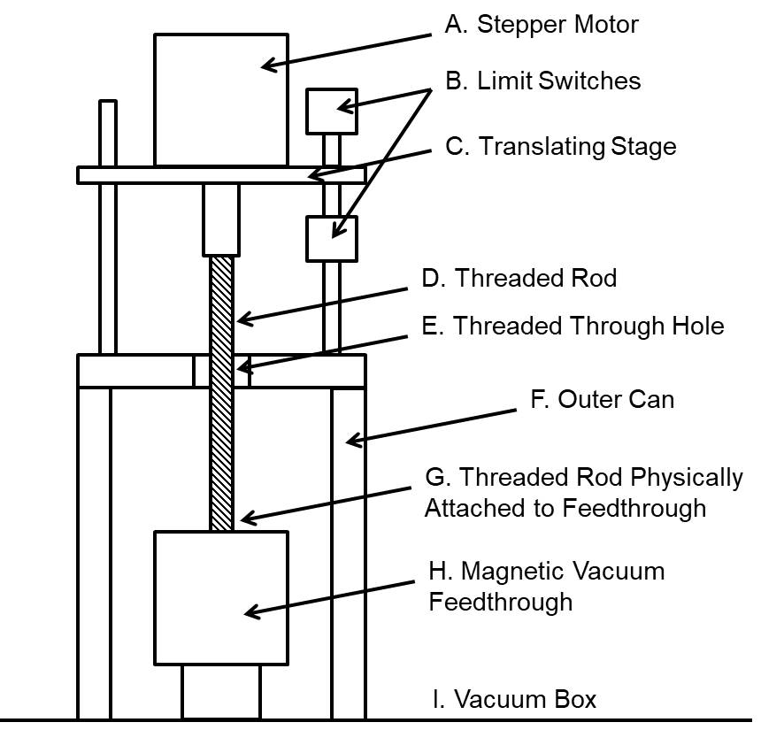

The goal of this post is to outline the general behavior of our rod rotator program with
example code for demonstration. It is not to go through everything line-by-line.
The project was originally developed by another postdoc, Oscar Martinez. It has been updated, refactored, expanded upon, and maintained by me. For the complete code, see [here]().

## The Problem

Studying the temperature-dependent kinetics of charged metal and metal-oxide nanoclusters
requires unique instrumentation. Reliably creating charged metal and metal-oxide nanoclusters can
be a challenge. Thanks to Nobel laureate Richard Smalley's game-changing laser vaporization
cluster source, a wide variety of metal and metal oxide clusters can be formed by
ablating a moving metal target with a high-power laser. In order to couple to existing
instrumentation, this meant designing our own.

The source itself involves a pulsed gas flow over a metal rod that is being ablated by a laser.
The gas expands into the vacuum chamber cooling the metal particles, allowing them to cluster.
The unique challenge inherent to the metal target is providing a fresh spot of
metal for each laser pulse (approximately), so what's needed is motion. We could rotate the
metal rod, but rotation can only provide a limited number of new "spots." What
we really need is rotation and up/down translation of the rod. Further, different metals
have different conditions that allow for cluster formation, including rod rotation speed.

## The Solution

Our design involves a stepper motor that turns a threaded 1/4-80 rod connected to a magnetic
vacuum feedthrough, on the other side of which is the metal rod target. Together, the stepper
motor and threaded rod allow for rotation and translation of the metal target at 80 rotations
per inch of vertical travel.

We will need variable rotation and translation speed controlled by pulsing the stepper
motor at different frequencies, the ability to reverse translation direction,
and it's probably a good idea to add some limits on translation
to prevent the metal rod from translating too far up or down and damaging the apparatus.

## Parts

* 1 x Stepper Motor
* 1 x Raspberry Pi 3
* 1 x Half Breadboard
* 2 x Limit Switches
* 1 x LED

A diagram of our current solution (Raspberry Pi and circuit not pictured):


The stepper motor (A) spins the threaded rod (D), which physically connected to
a magnetic feedthrough (H) that rotates the metal rod inside the vacuum box (I).
The stepper motor is connected to the Raspberry Pi GPIOs and rests on a vertically
translating stage (C), whose distance of travel is defined by the limit switches (B),
which are also connected to the Raspberry Pi. The translating stage itself moves the
entire stepper motor up and down because of the threaded through hole in the outer can (F).

How can we control all of this? Using a Raspberry Pi 3 and touchscreen mounted to the side of the instrument.

## Software and Control Hardware Design

For this project, I chose Python and the PyQt5 GUI framework to create an intuitive
touch application to control the rotation speed, total distance of travel, and alert the
user to a triggered limit switch. Python was chosen for its relatively quick development time
readability, the maturity of the PyQt5/Qt framework, and the author's familiarity.

Developing and customizing the GUI is as easy as "click and drag" with PyQt5 Designer.

The current rod rotator GUI:


The resulting interface has all of the inputs necessary to control the direction,
speed, and stepper motor pulse frequency.

Let's create a new .py script with the necessary PyQt5 libraries and a Window class that
will serve as the main window:

```python
import sys
import RPi.GPIO as GPIO
from PyQt5 import QtWidgets
from PyQt5.QtWidgets import (QWidget, QApplication, QLabel, qApp,
                             QLineEdit, QPushButton, QGridLayout)
import PyQt5.QtCore as QtCore
from PyQt5.QtCore import QPoint, pyqtSignal, pyqtSlot, Qt
import PyQt5.QtGui as QtGui

# GUI is imported from MTZv3_ui.py which needs to be in the same directory
from MTZv3_ui import Ui_Form as Main_Ui

class Window(QWidget):
    def __init__(self):
        super().__init__()

        # Setup the UI
        self.ui = Main_Ui()
        self.ui.setupUi(self)

# When widget is run from terminal:
if __name__ == "__main__":
    app = QApplication(sys.argv)
    window = Window()
    window.show()
    sys.exit(app.exec_())
```

### How do we control the stepper motor?

Basically, what inputs does the stepper motor need?

The stepper motor needs an input of 3.3 V for each pulse and a separate 3.3 V input
if it is to rotate in the reverse direction. Additionally, our program must know the
pulses per revolution specified by the motor (this is variable on our motor, hence the input box).

So, let's add the pinouts and program states:

```python
class Window(QWidget):
    def __init__(self):
        super().__init__()

        # Setup the UI
        self.ui = Main_Ui()
        self.ui.setupUi(self)

        ### Pin Assignments ###

        # Limit Switches:
        self.forwardLimitPin = 12
        self.backwardLimitPin = 19

        # "PUL+"" on Servo Drive (white wire)
        self.servoPulsePin = 17

        # Pin 27, to "DIR+" on servo drive set to HIGH
        # Setting this high and PUL+ high reverses stepper direction
        self.reverseDirectionPin = 27

        # Limit switch activated warning will be triggered on this input:
        self.limitSwitchWarningPin = 5
        self.buzzerPin = 23

        # Running LED:
        self.statusLEDPin = 18

        ### GPIO Setup ###

        GPIO.setmode(GPIO.BCM)
        GPIO.setwarnings(False)
        GPIO.setup(self.forwardLimitPin, GPIO.IN)
        GPIO.setup(self.backwardLimitPin, GPIO.IN)
        GPIO.setup(self.servoPulsePin, GPIO.OUT)
        GPIO.setup(self.reverseDirectionPin, GPIO.OUT)
        GPIO.setup(self.limitSwitchWarningPin, GPIO.OUT)
        GPIO.setup(self.buzzerPin, GPIO.OUT)
        GPIO.setup(self.statusLEDPin, GPIO.OUT)

        ### Program Inital State ###

        self._active = False
        self.direction = None
        self.screenLocked = False
        self.activeButton = None

        # Parameters for Travel:
        # Minutes per Inch
        self.MPI = None
        # Total number of pulses
        self.e = None
        # Time between pulses
        self.sec = None
        # Limit switch backoff number of pulses
        self.lsb = None
```

When we want to move the stepper motor, all we need to do is set the `servoPulsePin`
(and `reverseDirectionPin`) HIGH at the frequency corresponding to the desired rotation speed

We'll use this function to achieve that:

```python
# Function that processes a single stepper motor 'step'
# Called for each 'step' that the rod rotates
def pulseStepperMotorOnce(self, sec):
    if not self.dev:
        if self.direction == 'forward':
            time.sleep(sec)
            GPIO.output(self.servoPulsePin, GPIO.HIGH)
            time.sleep(0.0001)
            GPIO.output(self.servoPulsePin, GPIO.LOW)
        elif self.direction == 'reverse':
            time.sleep(sec)
            GPIO.output(self.reverseDirectionPin,GPIO.HIGH)
            GPIO.output(self.servoPulsePin, GPIO.HIGH)
            time.sleep(0.0001)
            GPIO.output(self.servoPulsePin, GPIO.LOW)
            GPIO.output(self.reverseDirectionPin, GPIO.LOW)
```

In order for us to know how long to wait between pulses of `servoPulsePin` HIGH
(the value of `sec`), we'll need to calculate it based on the other specified parameters.
Let's add a helper function to determine these values from the GUI inputs:

```python
# Uses input field values to calculate the total pulses, total 'backoff',
# pulses, delay time
# Called immediately before rod begins rotating
def calculateParameters(self):
    # From Frequency Input (Hz):
    frequencyOptions = [50, 100, 500, 1000, 2500]
    freqSliderVal = self.ui.frequencySlider.value()
    # Frequency (Hz):
    a = int(frequencyOptions[freqSliderVal])
    # Threads per Inch:
    b = int(self.ui.lineRodtpi.text())
    # Pulses per revolution:
    c = int(self.ui.linePulsePerRev.text())
    # Distance of travel (inches):
    lineDistanceOptions = [0.25, 0.5, 0.75, 1, 1.5]
    distanceSliderVal = self.ui.lineDistanceSlider.value()
    d = float(lineDistanceOptions[distanceSliderVal])
    # limit switch backoff:
    # 0.05 x thread/inch x pulse/rev
    # ex. 0.05 x 80 x 1,600 = 6,400
    lsb = 0.05 * b * c
    # inches x (thread/ 1 inches) x pulses/rev
    # ex. 1 x 80 x 1600 = 128,000 The total number of pulses
    e = d * b * c
    # Used as a wait time between pulses
    sec = 1 / a
    # Minutes per inch
    MPI = (sec * c * (1 / 60) * b) + (0.0001 * b * c * (1 / 60))
    return MPI, int(e), sec, int(lsb)
```

Now that the pulse frequency, threads per inch (80), and distance of travel
have been specified; and the total number of pulses, delay time between pulses, and
minutes per inch has been calculated, let's look at the logic that handles the
Up or Down direction:

```python
def moveStepperMotor(self, MPI, e, sec, lsb, loop=False):
    previousFreqValue = self.ui.frequencySlider.value()
    for index in range(e):
        if self.ui.frequencySlider.value() != previousFreqValue:
            self.MPI, self.e, self.sec, self.lsb = self.calculateParameters()
            self.ui.labelMinutesPerInch.setText("Minutes per inch = %.2f" %self.MPI)
            previousFreqValue = self.ui.frequencySlider.value()
        # Perform a single pulse of the stepper motor:
        self.pulseStepperMotorOnce(self.sec)

        self.ui.label.setText('Pulse Count = {0} / {1}'.format(index, self.e))
        qApp.processEvents()

        if loop:
            if not self._active and not self.ui.cb_nextTurn.isChecked():
                self.direction = None
                break
        elif not self._active:
                self.direction = None
                break

# Initiates rotation in one direction based on 'Up' or 'Down' button click
# Also stops rotation if it's already running and the same button is pressed
def handleRunOneDirection(self):
    button = self.sender()
    if not self._active and not self.activeButton:
        button.setText('Stop')
        self.activeButton = button
        self._active = True
        if button.objectName() == 'Down':
            self.direction = 'forward'
        elif button.objectName() == 'Up':
            self.direction = 'reverse'
        # Enables a thread that runs the function being passed
        QtCore.QTimer.singleShot(0, lambda: self.runOneDirection(button))
    # If a rotation loop is already running, it stops:
    elif self._active and button == self.activeButton:
        self._active = False
        self.activeButton = None

# helper function that handles some of the required function calls at the
# beginning of a run. In production, this does more than what's included
# below.
def initiateRun(self):
    MPI, e, sec, lsb = self.calculateParameters()
    self.ui.labelMinutesPerInch.setText("Minutes per inch = %.2f" %MPI)
    return MPI, e, sec, lsb

# Rotation loop. Terminates when total 'steps' is reached
def runOneDirection(self, button):
    self.MPI, self.e, self.sec, self.lsb, blinkLED = self.initiateRun()

      # from zero to 128,000 (for example)
    self.moveStepperMotor(self.MPI, self.e, self.sec, self.lsb)

    if button.objectName() == 'Down':
        button.setText('Down')
    elif button.objectName() == 'Up':
        button.setText('Up')

    self.resetStates(button)
```

The program keeps track of the running state (`self._active`), the button used to
initiate rotation (`self.button`), and the current rotation direction (`self.direction`)
for a few different reasons. The first is to prevent the rotation behavior from being initiated
more than once simultaneously by pressing multiple buttons without stopping the prior rotation.
Second, it's so the limit switches are "direction-less". The motor will back off in the
opposite direction of travel regardless of how the limit switches are positioned before stopping.

Speaking of limit switches, why do we even need them?

We need them because the maximum distance of travel is dictated by the physical size of
certain components that make up the mechanical rod rotator (e.g. the magnetic feedthrough and
length of the threaded rod). Allowing the stepper motor to move endlessly in one direction
would likely destroy the threads on the 1/4-80 rod and potentially damage the motor
or feed through. Best to avoid that...

At this point in the program, we've already calculated the number of pulses to send to the motor
that will allow it to rotate in the opposite direction relative to the current direction of travel
when the limit switch is triggered (`lsb` in `calculateParameters()`).

Let's add a condition to `moveStepperMotor()` that checks for a limit switch trigger
and a function that handles the limit switch behavior:

```python
# Checks to see if either limit switch is pressed. If pressed,
# backs off switch based on value of self.direction and returns True
# Renames button based on arguments
def triggeredLimitSwitch(self, lsb, sec):
  # If motor hits either limit switch on GPIO 12 or 19:
  if GPIO.input(self.forwardLimitPin) or GPIO.input(self.backwardLimitPin):
      if self.direction == 'forward':
          # Runs motor in reverse to back off the limit switch
          for index in range(lsb):
              time.sleep(sec)
              GPIO.output(self.reverseDirectionPin, GPIO.HIGH)
              GPIO.output(self.servoPulsePin, GPIO.HIGH)
              time.sleep(0.0001)
              GPIO.output(self.servoPulsePin, GPIO.LOW)
              GPIO.output(self.reverseDirectionPin, GPIO.LOW)
      elif self.direction == 'reverse':
          # Runs motor forward to backoff the limit switch
          for index in range(lsb):
              time.sleep(sec)
              GPIO.output(self.servoPulsePin, GPIO.HIGH)
              time.sleep(0.0001)
              GPIO.output(self.servoPulsePin, GPIO.LOW)

      # Enables limit switch warning on LCD and outputs to LabVIEW
      GPIO.output(self.limitSwitchWarningPin, GPIO.HIGH)
      # Enables buzzer sound
      GPIO.output(self.buzzerPin, GPIO.HIGH)
      self.ui.ResetWarning.setStyleSheet("background-color: red; color: white; font-weight: bold;")
      self._active = False
      self.direction = None
      return True
  else:
      return False

def moveStepperMotor(self, MPI, e, sec, lsb, loop=False):
    previousFreqValue = self.ui.frequencySlider.value()
    for index in range(e):
        # ...

        # Perform a single pulse of the stepper motor:
        self.pulseStepperMotorOnce(sec)

        # If it doesn't hit the limit switch:
        if not self.triggeredLimitSwitch(lsb, sec):
            self.ui.label.setText('Pulse Count = {0} / {1}'.format(index, e))
            qApp.processEvents()
        else:
            self.direction = None
            break

        # ...
```

Now the program will check for a HIGH signal on either `self.forwardLimitPin` or `self.backwardLimitPin`. If HIGH,
it will "back off" the limit switch in the opposite direction of travel, set a buzzer output pin HIGH, and
display a warning on the GUI.

The last aspect of the program that we need to add is a way to loop over both the "Up" and "Down"
directions. It's not very useful to have the metal rod stop moving after a minute or so. We
want it to rotate back and forth until stopped by a button press. So, we'll add an additional
function to handle the looping behavior:

```python
# Intiates forward rotation loop
def handleRunLoop(self):
    button = self.sender()
    if not self._active and not self.activeButton:
        self._active = True
        button.setText('Stop')
        self.activeButton = button
        if button.objectName() == 'UpLoop':
            QtCore.QTimer.singleShot(0, lambda: self.runLoop('reverse', button))
        elif button.objectName() == 'DownLoop':
            QtCore.QTimer.singleShot(0, lambda: self.runLoop('forward', button))
    elif self._active and not self.ui.cb_nextTurn.isChecked():
        if button == self.activeButton:
            self._active = False
            self.activeButton = None
    elif self._active and self.ui.cb_nextTurn.isChecked():
        if button == self.activeButton:
            button.setEnabled(False)
            self._active = False
            button.setText('Stopping...')

# Forward rotation loop. Alternates between forward and backward directions
def runLoop(self, startDirection, button):
    self.MPI,self. e, self.sec, self.lsb = self.initiateRun()

    while True:

        # Forward part of loop
        self.direction = startDirection
        self.moveStepperMotor(self.MPI, self.e, self.sec, self.lsb, True)

        if not self._active and self.ui.cb_nextTurn.isChecked():
            self.direction = None
            break

        # Backward part of loop
        if startDirection == 'forward':
            self.direction = 'reverse'
        elif startDirection == 'reverse':
            self.direction = 'forward'

        self.moveStepperMotor(self.MPI, self.e, self.sec, self.lsb, True)

        if not self._active and self.ui.cb_nextTurn.isChecked():
            self.direction = None
            break

        if not self._active:
            self.direction = None
            break

    if button.objectName() == 'DownLoop':
        button.setText('Start Loop (Down)')
    elif button.objectName() == 'UpLoop':
        button.setText('Start Loop (Up)')

    self.ui.cb_nextTurn.setChecked(False)
    self.resetStates(button)
```

That's it! I omitted a few features that can be found in the full source code,
but at this point, you should have a good idea of the functionality of our Raspberry Pi
driven metal rod rotator and be able to adapt it to similar applications.
